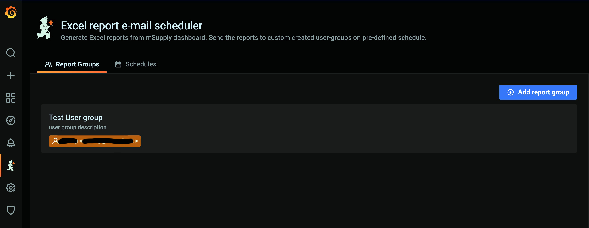
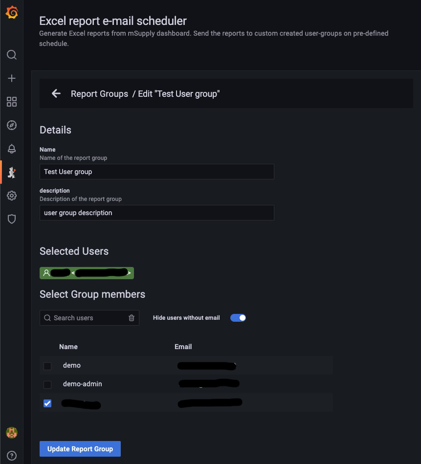

# Report Groups Page

Report Groups are groups of users (members). These users are users from mSupply, queried from dashboard's Postgresql database. Preferably they should have email address as the main purpose of creating these report groups is to send emails to all users in the group when a schedule triggers.

Admin can create Report groups, they can edit its details or add or remove members from it.

A report group must have at least one user to be entered in plugin database.

# Screenshot

Report groups list page

---

Report groups edit page
