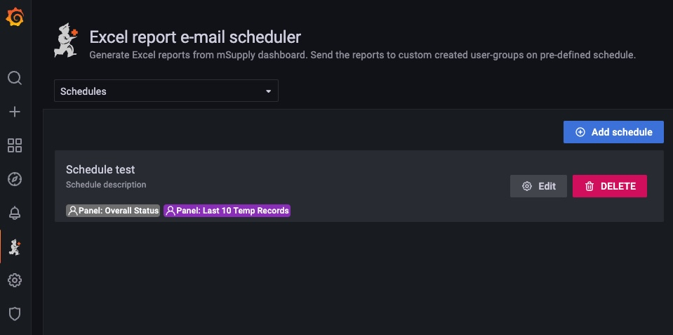

# Schedule Page

Schedules are schedules set by admins. It will run on set time on a daily daily, weekly etc. schedule.

Admin can select report groups to send emails to and can also select Grafana dashboard panels to generate reports out. The panels data are then converted into Excel files and emailed to the members of the report group.

You can also specify variables for the panels when the variables features are available. Variables are panel variables that the user set in mSupply dashboard variables option and include in the panel query.

There are two types of main variables.

- Lookback
  - Lookback are date time variables, if time constraints are set in the query you can specify lookback and only the data within the period in the lookback would be included in the report.
- Variables
  - You can set different types of variables and specify them in the query as constraint.
    - For example if you set a query variable that looks for specific store, include that variable in the panel query, then the report would only show data that contains the field value(s) specified in the variable.

# Screenshot

Schedule list page

---

Schedule edit page
